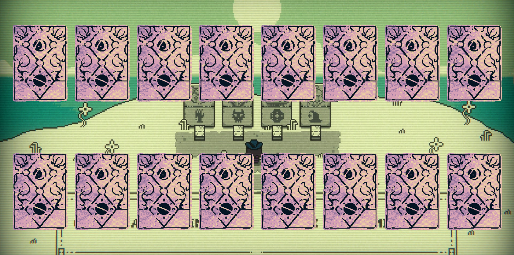

# Inscryption Memory Game

Project created using HTML, CSS and some JavaScript with a theme of the card game Inscryption.

## How to play

- Click on any card to reveal it.
- Try to match two of the same cards.
- Match all the cards to win.
- Have fun!

## Screenshot

## Links

- Live Site URL: [Inscryption Memory Game](http://adrielgamorim.github.io/inscryption-memory-game/)

## Author

- Website - [Adriel Amorim](https://adrielgamorim.github.io/Portfolio/)
- LinkedIn - [Adriel Amorim](https://www.linkedin.com/in/adrielamorim/)
